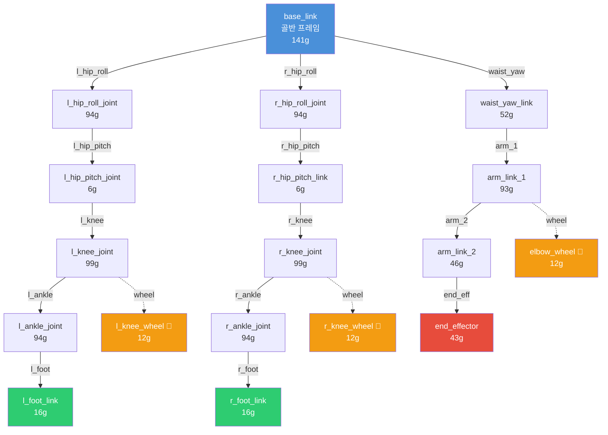

# 🤖 Biped Bike Robot — 로봇 구조 분석 문서

> **biped_bike_robot_ver2** — SolidWorks에서 설계된 이족보행 자전거 탑승 로봇  
> ROS 2 Jazzy + Gazebo Harmonic 환경

---

## 📐 관절 트리 다이어그램 (Joint Tree)

```
base_link (골반/허리 프레임)
├── [L] l_hip_roll_joint_jnt  ─── l_hip_roll_joint (좌측 고관절 롤)
│   └── l_hip_pitch_joint_jnt ─── l_hip_pitch_joint (좌측 고관절 피치)
│       └── l_knee_joint_jnt ──── l_knee_joint (좌측 무릎)
│           ├── l_ankle_joint_jnt ── l_ankle_joint (좌측 발목)
│           │   └── l_foot_link_jnt ── l_foot_link (좌측 발)
│           └── l_knee_wheel_jnt ─── l_knee_wheel (좌측 무릎 휠) 🔄
│
├── [R] r_hip_roll_joint_jnt  ─── r_hip_roll_joint (우측 고관절 롤)
│   └── r_hip_pitch_link_jnt ─── r_hip_pitch_link (우측 고관절 피치)
│       └── r_knee_joint_jnt ──── r_knee_joint (우측 무릎)
│           ├── r_ankle_joint_jnt ── r_ankle_joint (우측 발목)
│           │   └── r_foot_link_jnt ── r_foot_link (우측 발)
│           └── r_knee_wheel_jnt ─── r_knee_wheel (우측 무릎 휠) 🔄
│
└── [U] waist_yaw_link_jnt ── waist_yaw_link (허리 요)
    └── arm_link_1_jnt ────── arm_link_1 (상완)
        ├── arm_link_2_jnt ── arm_link_2 (전완)
        │   └── end_effector_jnt ── end_effector (엔드이펙터/핸들)
        └── elbow_wheel_jnt ── elbow_wheel (팔꿈치 휠) 🔄
```

> 🔄 = `continuous` 타입 (무한 회전 가능한 패시브 휠 관절)

---

## 📊 링크 목록 (18개)

| # | 링크 이름 | 위치 | 질량 (kg) | 설명 |
|---|-----------|------|-----------|------|
| 1 | `base_link` | 중심 | 0.141 | 골반/메인 프레임 |
| 2 | `l_hip_roll_joint` | 좌측 | 0.094 | 좌측 고관절 롤 링크 |
| 3 | `l_hip_pitch_joint` | 좌측 | 0.006 | 좌측 고관절 피치 링크 |
| 4 | `l_knee_joint` | 좌측 | 0.099 | 좌측 허벅지 (상부 다리) |
| 5 | `l_ankle_joint` | 좌측 | 0.094 | 좌측 정강이 (하부 다리) |
| 6 | `l_foot_link` | 좌측 | 0.016 | 좌측 발 |
| 7 | `l_knee_wheel` | 좌측 | 0.012 | 좌측 무릎 보조 휠 |
| 8 | `r_hip_roll_joint` | 우측 | 0.094 | 우측 고관절 롤 링크 |
| 9 | `r_hip_pitch_link` | 우측 | 0.006 | 우측 고관절 피치 링크 |
| 10 | `r_knee_joint` | 우측 | 0.099 | 우측 허벅지 (상부 다리) |
| 11 | `r_ankle_joint` | 우측 | 0.094 | 우측 정강이 (하부 다리) |
| 12 | `r_foot_link` | 우측 | 0.016 | 우측 발 |
| 13 | `r_knee_wheel` | 우측 | 0.012 | 우측 무릎 보조 휠 |
| 14 | `waist_yaw_link` | 상체 | 0.052 | 허리 요 회전부 |
| 15 | `arm_link_1` | 상체 | 0.093 | 상완 (어깨→팔꿈치) |
| 16 | `arm_link_2` | 상체 | 0.046 | 전완 (팔꿈치→손목) |
| 17 | `end_effector` | 상체 | 0.043 | 핸들 그립 / 엔드이펙터 |
| 18 | `elbow_wheel` | 상체 | 0.012 | 팔꿈치 보조 휠 |

> **총 질량**: 약 **0.934 kg**

---

## 🔩 관절 목록 (17개)

### 좌측 다리 (Left Leg) — 5 액추에이터 + 1 패시브

| # | 관절 이름 (patched) | 타입 | 축 | 부모 → 자식 |
|---|---------------------|------|-----|-------------|
| 1 | `l_hip_roll_joint_jnt` | revolute | Z(-) | base_link → l_hip_roll_joint |
| 2 | `l_hip_pitch_joint_jnt` | revolute | Z(+) | l_hip_roll_joint → l_hip_pitch_joint |
| 3 | `l_knee_joint_jnt` | revolute | Z(+) | l_hip_pitch_joint → l_knee_joint |
| 4 | `l_ankle_joint_jnt` | revolute | Z(+) | l_knee_joint → l_ankle_joint |
| 5 | `l_foot_link_jnt` | revolute | Z(-) | l_ankle_joint → l_foot_link |
| 6 | `l_knee_wheel_jnt` | **continuous** | Z(+) | l_knee_joint → l_knee_wheel |

### 우측 다리 (Right Leg) — 5 액추에이터 + 1 패시브

| # | 관절 이름 (patched) | 타입 | 축 | 부모 → 자식 |
|---|---------------------|------|-----|-------------|
| 7 | `r_hip_roll_joint_jnt` | revolute | Z(-) | base_link → r_hip_roll_joint |
| 8 | `r_hip_pitch_link_jnt` | revolute | Z(-) | r_hip_roll_joint → r_hip_pitch_link |
| 9 | `r_knee_joint_jnt` | revolute | Z(-) | r_hip_pitch_link → r_knee_joint |
| 10 | `r_ankle_joint_jnt` | revolute | Z(-) | r_knee_joint → r_ankle_joint |
| 11 | `r_foot_link_jnt` | revolute | Z(-) | r_ankle_joint → r_foot_link |
| 12 | `r_knee_wheel_jnt` | **continuous** | Z(-) | r_knee_joint → r_knee_wheel |

### 상체 (Upper Body) — 4 액추에이터 + 1 패시브

| # | 관절 이름 (patched) | 타입 | 축 | 부모 → 자식 |
|---|---------------------|------|-----|-------------|
| 13 | `waist_yaw_link_jnt` | revolute | Z(-) | base_link → waist_yaw_link |
| 14 | `arm_link_1_jnt` | revolute | Z(+) | waist_yaw_link → arm_link_1 |
| 15 | `arm_link_2_jnt` | revolute | Z(+) | arm_link_1 → arm_link_2 |
| 16 | `end_effector_jnt` | revolute | Z(+) | arm_link_2 → end_effector |
| 17 | `elbow_wheel_jnt` | **continuous** | Z(-) | arm_link_1 → elbow_wheel |

> ⚠️ **관절 이름 참고**: SolidWorks 원본은 `_jnt` 접미사, 패치 후 URDF는 `_jnt_jnt` 접미사 (이중 접미사 이슈). `patch_urdf.py` 참고.

---

## 🦿 설계 특징

### 1. 좌우 대칭 이족 구조
- 각 다리: **5 DOF** (Hip Roll → Hip Pitch → Knee → Ankle → Foot)
- 좌우 다리는 `base_link`에서 Y축 방향으로 63mm 오프셋 (좌: y=-0.006, 우: y=-0.069)
- 고관절 롤(Roll)은 `rpy="0 -π/2 π"`로 90° 회전하여 측면 운동축을 구현

### 2. 자전거 페달링을 위한 패시브 휠
- `l_knee_wheel`, `r_knee_wheel`, `elbow_wheel` — 3개의 **continuous** 관절
- 무릎 및 팔꿈치에 배치되어 자전거 크랭크/핸들과 접촉하는 보조 회전축
- 토크 미지정 (패시브, 자유 회전)

### 3. 단일 팔 + 핸들 조향
- `waist_yaw_link` → `arm_link_1` → `arm_link_2` → `end_effector`
- 상완 길이 약 113mm, 전완 길이 약 162mm
- `end_effector`가 자전거 핸들을 잡는 구조

### 4. 서보 모터 기반 소형 로봇
- 총 질량 약 934g (1kg 미만의 소형 로봇)
- 모든 메시가 STL 형식 (SolidWorks 직접 내보내기)
- 관절 리밋이 모두 `lower=0, upper=0, effort=0, velocity=0` → **추후 설정 필요**

---

## 📁 패키지 구조

```
biped_bike_robot/
├── CMakeLists.txt
├── package.xml
├── README.md                    ← 이 문서
├── config/
│   └── rviz_config.rviz         ← RViz 시각화 설정
├── launch/
│   └── ...                      ← 런치 파일
├── meshes/                      ← 패치된 메시 (18개 STL)
│   ├── base_link.STL
│   ├── l_hip_roll_joint.STL
│   ├── l_hip_pitch_joint.STL
│   ├── l_knee_joint.STL
│   ├── l_ankle_joint.STL
│   ├── l_foot_link.STL
│   ├── l_knee_wheel.STL
│   ├── r_hip_roll_joint.STL
│   ├── r_hip_pitch_link.STL
│   ├── r_knee_joint.STL
│   ├── r_ankle_joint.STL
│   ├── r_foot_link.STL
│   ├── r_knee_wheel.STL
│   ├── waist_yaw_link.STL
│   ├── arm_link_1.STL
│   ├── arm_link_2.STL
│   ├── end_effector.STL
│   └── elbow_wheel.STL
├── urdf/
│   └── biped_bike_robot.urdf    ← 패치 적용된 최종 URDF
├── scripts/
│   └── patch_urdf.py            ← SolidWorks→ROS 2 변환 패치
└── solidworks_export/           ← SolidWorks 원본 (수정 금지)
    ├── README.md
    ├── urdf/
    │   └── biped_bike_robot_ver2.urdf
    └── meshes/
        └── *.STL (18개)
```

---

## 🔗 관절 연쇄 다이어그램 (Kinematic Chain)



---

## 📝 참고 사항

- **URDF 생성**: SolidWorks to URDF Exporter v1.6.0-4-g7f85cfe
- **패치 스크립트**: `scripts/patch_urdf.py`로 패키지 경로 변환 및 관절명 정리 수행
- **관절 리밋 미설정**: 모든 revolute 관절의 `effort`, `velocity`, `lower`, `upper`가 0 → 실제 서보 사양에 맞게 설정 필요
- **좌표계**: SolidWorks 기본 좌표계 사용 (일부 관절에 90° 회전 보정 적용됨)
