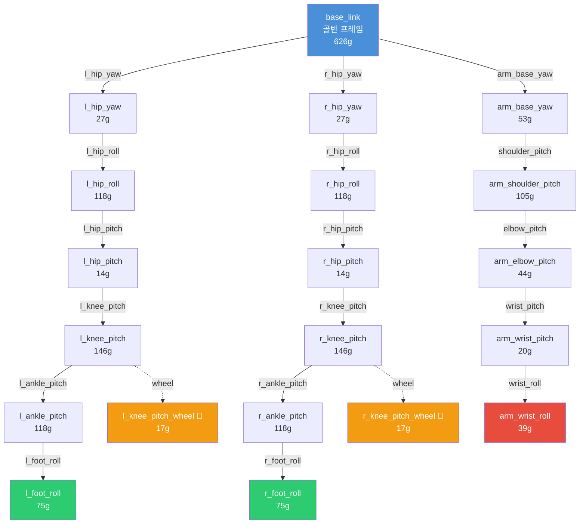

# 🤖 Biped Bike Robot

> **biped_bike_robot_print_ver6** — SolidWorks에서 설계하고 실물 구동으로 검증 중인 **이족보행 ↔ 2구동 휠 + 볼캐스터 변환 로봇**  
> ROS 2 Jazzy + Gazebo Harmonic 환경

### ✨ 현재 URDF 반영 상태
- **최신 URDF**: `urdf/biped_bike_robot.urdf`
- **원본 익스포트**: `solidworks_export/urdf/biped_bike_robot_print_ver6.urdf`
- **구조**: 20 links, 19 joints = 17 actuated revolute joints + 2 continuous knee wheel joints
- **총 질량**: 약 **1.917 kg** (`base_link`에 메인 프레임, 배터리, 제어보드 질량 반영)
- **구동 모드**: 12자유도 이족보행, 팔 지지 기반 변신, 2륜 주행 모드

---

## 🎥 실물 구동 데모

### 1. 이족 보행 (Bipedal Walking)


### 2. 차륜형 변신 (Transform to Wheeled Mode)


### 3. 이족 보행 모드 복귀 (Reverse Transform)


### 4. 바이크 모드 주행 (Wheeled Driving)


---

## 📐 관절 트리 다이어그램 (Joint Tree)

```
base_link (골반/허리 프레임)
├── [L] l_hip_yaw ──────── l_hip_yaw (좌측 고관절 요)
│   └── l_hip_roll ─────── l_hip_roll (좌측 고관절 롤)
│       └── l_hip_pitch ── l_hip_pitch (좌측 고관절 피치)
│           └── l_knee_pitch ── l_knee_pitch (좌측 무릎)
│               ├── l_ankle_pitch ── l_ankle_pitch (좌측 발목)
│               │   └── l_foot_roll ── l_foot_roll (좌측 발)
│               └── l_knee_pitch_wheel ── l_knee_pitch_wheel (좌측 무릎 휠) 🔄
│
├── [R] r_hip_yaw ──────── r_hip_yaw (우측 고관절 요)
│   └── r_hip_roll ─────── r_hip_roll (우측 고관절 롤)
│       └── r_hip_pitch ── r_hip_pitch (우측 고관절 피치)
│           └── r_knee_pitch ── r_knee_pitch (우측 무릎)
│               ├── r_ankle_pitch ── r_ankle_pitch (우측 발목)
│               │   └── r_foot_roll ── r_foot_roll (우측 발)
│               └── r_knee_pitch_wheel ── r_knee_pitch_wheel (우측 무릎 휠) 🔄
│
└── [U] arm_base_yaw ──── arm_base_yaw (팔 베이스 요)
    └── arm_shoulder_pitch ── arm_shoulder_pitch (어깨 피치)
        ├── arm_elbow_pitch ── arm_elbow_pitch (팔꿈치 피치)
        │   └── arm_wrist_pitch ── arm_wrist_pitch (손목 피치)
        │       └── arm_wrist_roll ── arm_wrist_roll (손목 롤)
```

> 🔄 = `continuous` 타입 (무한 회전 가능한 패시브 휠 관절)
> 현재 구조에서는 팔 끝 지지를 회전 휠 조인트가 아니라 볼캐스터 구조로 처리합니다.

---

## 📊 링크 목록 (20개)

| # | 링크 이름 | 위치 | 질량 (kg) | 설명 |
|---|-----------|------|-----------|------|
| 1 | `base_link` | 중심 | 0.626 | 골반/메인 프레임 (메인 기판 및 배터리 반영) |
| 2 | `l_hip_yaw` | 좌측 | 0.027 | 좌측 고관절 요 회전부 |
| 3 | `l_hip_roll` | 좌측 | 0.118 | 좌측 고관절 롤 링크 |
| 4 | `l_hip_pitch` | 좌측 | 0.014 | 좌측 고관절 피치 링크 |
| 5 | `l_knee_pitch` | 좌측 | 0.146 | 좌측 허벅지 (상부 다리) |
| 6 | `l_ankle_pitch` | 좌측 | 0.118 | 좌측 정강이 (하부 다리) |
| 7 | `l_foot_roll` | 좌측 | 0.075 | 좌측 발 |
| 8 | `l_knee_pitch_wheel` | 좌측 | 0.017 | 좌측 무릎 구동 휠 |
| 9 | `r_hip_yaw` | 우측 | 0.027 | 우측 고관절 요 회전부 |
| 10 | `r_hip_roll` | 우측 | 0.118 | 우측 고관절 롤 링크 |
| 11 | `r_hip_pitch` | 우측 | 0.014 | 우측 고관절 피치 링크 |
| 12 | `r_knee_pitch` | 우측 | 0.146 | 우측 허벅지 (상부 다리) |
| 13 | `r_ankle_pitch` | 우측 | 0.118 | 우측 정강이 (하부 다리) |
| 14 | `r_foot_roll` | 우측 | 0.075 | 우측 발 |
| 15 | `r_knee_pitch_wheel` | 우측 | 0.017 | 우측 무릎 구동 휠 |
| 16 | `arm_base_yaw` | 상체 | 0.053 | 팔 베이스 요 회전부 |
| 17 | `arm_shoulder_pitch` | 상체 | 0.105 | 상완 (어깨 피치) |
| 18 | `arm_elbow_pitch` | 상체 | 0.044 | 전완 (팔꿈치 피치) |
| 19 | `arm_wrist_pitch` | 상체 | 0.020 | 손목 피치 |
| 20 | `arm_wrist_roll` | 상체 | 0.039 | 손목 롤 / 엔드이펙터 |
> **총 질량**: 약 **1.917 kg** (URDF inertial mass 합산)

---

## 🔩 관절 목록 (19개)

### 좌측 다리 (Left Leg) — 6 액추에이터 + 1 패시브

| # | 관절 이름 | 타입 | 축 | 부모 → 자식 |
|---|-----------|------|-----|-------------|
| 1 | `l_hip_yaw` | revolute | Z(-) | base_link → l_hip_yaw |
| 2 | `l_hip_roll` | revolute | Z(-) | l_hip_yaw → l_hip_roll |
| 3 | `l_hip_pitch` | revolute | Z(+) | l_hip_roll → l_hip_pitch |
| 4 | `l_knee_pitch` | revolute | Z(-) | l_hip_pitch → l_knee_pitch |
| 5 | `l_ankle_pitch` | revolute | Z(-) | l_knee_pitch → l_ankle_pitch |
| 6 | `l_foot_roll` | revolute | Z(-) | l_ankle_pitch → l_foot_roll |
| 7 | `l_knee_pitch_wheel` | **continuous** | Z(-) | l_knee_pitch → l_knee_pitch_wheel |

### 우측 다리 (Right Leg) — 6 액추에이터 + 1 패시브

| # | 관절 이름 | 타입 | 축 | 부모 → 자식 |
|---|-----------|------|-----|-------------|
| 8 | `r_hip_yaw` | revolute | Z(-) | base_link → r_hip_yaw |
| 9 | `r_hip_roll` | revolute | Z(-) | r_hip_yaw → r_hip_roll |
| 10 | `r_hip_pitch` | revolute | Z(-) | r_hip_roll → r_hip_pitch |
| 11 | `r_knee_pitch` | revolute | Z(-) | r_hip_pitch → r_knee_pitch |
| 12 | `r_ankle_pitch` | revolute | Z(-) | r_knee_pitch → r_ankle_pitch |
| 13 | `r_foot_roll` | revolute | Z(-) | r_ankle_pitch → r_foot_roll |
| 14 | `r_knee_pitch_wheel` | **continuous** | Z(+) | r_knee_pitch → r_knee_pitch_wheel |

### 상체 (Upper Body) — 5 액추에이터

| # | 관절 이름 | 타입 | 축 | 부모 → 자식 |
|---|-----------|------|-----|-------------|
| 15 | `arm_base_yaw` | revolute | Z(-) | base_link → arm_base_yaw |
| 16 | `arm_shoulder_pitch` | revolute | Z(+) | arm_base_yaw → arm_shoulder_pitch |
| 17 | `arm_elbow_pitch` | revolute | Z(+) | arm_shoulder_pitch → arm_elbow_pitch |
| 18 | `arm_wrist_pitch` | revolute | Z(-) | arm_elbow_pitch → arm_wrist_pitch |
| 19 | `arm_wrist_roll` | revolute | Z(-) | arm_wrist_pitch → arm_wrist_roll |

---

## 🦿 설계 특징

### 1. 좌우 대칭 이족 구조
- 각 다리: **6 DOF** (Hip Yaw → Hip Roll → Hip Pitch → Knee Pitch → Ankle Pitch → Foot Roll)
- 좌우 다리는 `base_link`에서 Y축 방향으로 오프셋 (좌: y=-0.01425, 우: y=-0.13925)
- 고관절 롤(Roll)은 `rpy="0 -π/2 0"`로 90° 회전하여 측면 운동축을 구현

### 2. 차륜 모드를 위한 휠과 볼캐스터
- `l_knee_pitch_wheel_jnt`, `r_knee_pitch_wheel_jnt` — 2개의 **continuous** 구동 휠 관절
- 팔 끝 지지는 `arm_wheel_pitch_` 조인트 없이 볼캐스터 구조로 처리

### 3. 단일 팔 지지 구조
- `arm_base_yaw` → `arm_shoulder_pitch` → `arm_elbow_pitch` → `arm_wrist_pitch` → `arm_wrist_roll`
- `arm_wrist_roll`이 자전거 핸들을 잡는 최종 엔드이펙터

### 4. 서보 모터 기반 소형 로봇
- 총 질량 약 **1.917 kg**
- 모든 메시가 STL 형식 (SolidWorks 직접 내보내기)
- URDF에는 Gazebo friction/contact 및 `ros2_control` 인터페이스가 포함되어 있습니다.

---

## 📁 패키지 구조

```
biped_bike_robot/
├── CMakeLists.txt
├── package.xml
├── README.md                    ← 이 문서
├── config/
│   ├── controllers.yaml         ← ros2_control 컨트롤러 설정
│   └── dynamixel_hardware.yaml  ← 실물 Dynamixel ID/방향/제한 설정
├── launch/
│   ├── display.launch.py        ← RViz 모델 표시
│   ├── gazebo.launch.py         ← Gazebo 시뮬레이션 런치
│   └── hardware_display.launch.py ← 실물 브릿지 + RViz/robot_state_publisher
├── media/
│   ├── walking.gif              ← 실물 보행 데모
│   ├── transform.gif            ← 실물 변신 데모
│   ├── revert_transform.gif     ← 실물 역변신 데모
│   └── drive.gif                ← 실물 주행 데모
├── meshes/                      ← 메시 파일 (20개 STL)
│   ├── base_link.STL
│   ├── l_hip_yaw.STL
│   ├── l_hip_roll.STL
│   ├── l_hip_pitch.STL
│   ├── l_knee_pitch.STL
│   ├── l_ankle_pitch.STL
│   ├── l_foot_roll.STL
│   ├── l_knee_pitch_wheel.STL
│   ├── r_hip_yaw.STL
│   ├── r_hip_roll.STL
│   ├── r_hip_pitch.STL
│   ├── r_knee_pitch.STL
│   ├── r_ankle_pitch.STL
│   ├── r_foot_roll.STL
│   ├── r_knee_pitch_wheel.STL
│   ├── arm_base_yaw.STL
│   ├── arm_shoulder_pitch.STL
│   ├── arm_elbow_pitch.STL
│   ├── arm_wrist_pitch.STL
│   └── arm_wrist_roll.STL
├── urdf/
│   └── biped_bike_robot.urdf    ← 최신 보정 URDF (print ver6 기반)
├── scripts/
│   ├── ik_walker.py             ← IK 기반 보행 엔진
│   ├── transform_bike.py        ← 바이크 모드 변신 시퀀스
│   ├── revert_bike.py           ← 이족보행 모드 복구 시퀀스
│   ├── bike_teleop.py           ← 키보드(WASD) 주행 컨트롤러
│   ├── dxl_joint_state_bridge.py ← 실물 Dynamixel 브릿지
│   ├── imu_base_tf.py           ← OpenCR IMU 기반 base_link TF 보정
│   ├── web_control.py           ← 실물 테스트용 웹 컨트롤 패널
│   ├── ready_posture.py         ← 기본 준비 자세 초기화
│   └── patch_urdf.py            ← SolidWorks→ROS 2 자동 보정 도구
└── solidworks_export/             ← SolidWorks 원본 (수정 금지)
    ├── README.md
    ├── urdf/biped_bike_robot_print_ver6.urdf
    └── meshes/
```

---

## 🧭 OpenCR IMU 데이터 형식과 강화학습 입력 기준

현재 실제 로봇 제어 중 IMU는 OpenCR 내장 IMU를 사용합니다. OpenCR은 Dynamixel TTL 브리지 역할을 하면서, 가상 Dynamixel ID `200`으로 IMU 값을 응답합니다. PC 쪽 `dxl_joint_state_bridge.py`가 이 값을 읽어서 ROS 표준 메시지인 `sensor_msgs/Imu`로 변환해 `/opencr/imu`에 publish합니다.

### 실행 경로

```bash
ros2 launch biped_bike_robot hardware_display.launch.py \
  enable_opencr_imu:=true \
  enable_imu_tf:=true \
  use_joint_state_gui:=false \
  publish_present_joint_states:=true \
  enable_joint_state_commands:=false \
  enable_trajectory_commands:=true \
  startup_ready_posture_on_start:=true \
  center_on_start:=false
```

확인은 다음처럼 합니다.

```bash
ros2 topic echo /opencr/imu
ros2 run tf2_ros tf2_echo world base_link
```

웹 컨트롤러의 하드웨어 ON 버튼도 위 설정을 기본으로 실행합니다.

### OpenCR 가상 IMU 블록

OpenCR 스케치 `arduino/opencr_dxl_bridge_with_imu/opencr_dxl_bridge_with_imu.ino`는 주소 `100`부터 `68 byte`짜리 IMU 블록을 만듭니다. PC에서는 Dynamixel Protocol 2.0 read로 이 블록을 읽습니다.

| Offset | Type | 이름 | 단위/의미 |
|---:|---|---|---|
| 100 | `uint32` | `time_ms` | OpenCR 부팅 후 ms |
| 104 | `float` | `qw` | OpenCR IMU quaternion w |
| 108 | `float` | `qx` | OpenCR IMU quaternion x |
| 112 | `float` | `qy` | OpenCR IMU quaternion y |
| 116 | `float` | `qz` | OpenCR IMU quaternion z |
| 120 | `float` | `roll_deg` | roll, degree |
| 124 | `float` | `pitch_deg` | pitch, degree |
| 128 | `float` | `yaw_deg` | yaw, degree |
| 132 | `float` | `gyro_x_dps` | gyro x, degree/sec |
| 136 | `float` | `gyro_y_dps` | gyro y, degree/sec |
| 140 | `float` | `gyro_z_dps` | gyro z, degree/sec |
| 144 | `float` | `acc_x_g` | accel x, g |
| 148 | `float` | `acc_y_g` | accel y, g |
| 152 | `float` | `acc_z_g` | accel z, g |
| 156 | `int16` | `gyro_x_adc` | raw gyro x |
| 158 | `int16` | `gyro_y_adc` | raw gyro y |
| 160 | `int16` | `gyro_z_adc` | raw gyro z |
| 162 | `int16` | `acc_x_adc` | raw accel x |
| 164 | `int16` | `acc_y_adc` | raw accel y |
| 166 | `int16` | `acc_z_adc` | raw accel z |

PC 쪽에서는 이 블록을 다음 형식으로 unpack합니다.

```python
struct.unpack("<I13f6h", bytes(data))
```

### ROS 토픽 형식

`/opencr/imu`는 `sensor_msgs/Imu`입니다. 강화학습에서 ROS 토픽을 바로 쓰면 이 형식을 기준으로 받으면 됩니다.

```text
header.frame_id: body_link
orientation: quaternion, x/y/z/w
angular_velocity: rad/s
linear_acceleration: m/s^2
```

변환 규칙은 다음과 같습니다.

| ROS 필드 | 원본 OpenCR 값 | 변환 |
|---|---|---|
| `orientation.w/x/y/z` | `qw/qx/qy/qz` | 그대로 사용 |
| `angular_velocity.x/y/z` | `gyro_*_dps` | `deg/s * pi / 180` |
| `linear_acceleration.x/y/z` | `acc_*_g` | `g * 9.80665` |
| `orientation_covariance` | 고정값 | 대각선 `0.0025` |
| `angular_velocity_covariance` | 고정값 | 대각선 `0.02` |
| `linear_acceleration_covariance` | 고정값 | 대각선 `0.04` |

중요한 점은 `/opencr/imu`의 quaternion은 OpenCR 보드 기준 원본 자세라는 것입니다. 보드가 로봇 등 뒤에 수직으로 달려 있어서, 이 값을 그대로 쓰면 로봇의 roll/pitch/yaw 감각과 다르게 보입니다.

### 로봇 기준 자세 보정

로봇 기준 자세 시각화는 `imu_base_tf.py`가 담당합니다. 이 노드는 `/opencr/imu`를 받아서 `world -> base_link` TF를 publish합니다.

현재 기본 보정값은 등 뒤 수직 장착 기준입니다.

| 파라미터 | 기본값 | 의미 |
|---|---:|---|
| `imu_mount_roll_deg` | `-90.0` | OpenCR 보드 장착 roll 보정 |
| `imu_mount_pitch_deg` | `0.0` | 장착 pitch 보정 |
| `imu_mount_yaw_deg` | `0.0` | 장착 yaw 보정 |
| `imu_rpy_remap` | `YRp` | roll/pitch/yaw 축 재매핑. 대문자는 부호 반전 |
| `imu_zero_yaw_on_start` | `true` | 켤 때 yaw를 정면 0으로 잡음 |
| `imu_yaw_zero_samples` | `10` | 처음 10개 샘플 평균으로 yaw zero 계산 |
| `imu_pivot_x/y/z` | `-0.066549, -0.076779, 0.018299` | base_link 중앙 기준 회전 pivot 보정 |

즉 RViz와 웹 뷰어에서 로봇이 기울어지는 자세는 원본 `/opencr/imu`가 아니라 보정된 `/tf`의 `world -> base_link`를 보고 있습니다. 강화학습에서 로봇 몸통 기준 roll/pitch/yaw를 쓰고 싶으면 이 보정된 TF 또는 동일한 보정식을 적용한 quaternion을 쓰는 것이 안전합니다.

### 강화학습 observation 추천

가장 무난한 IMU 관측값은 다음입니다.

```text
base_orientation_quat: [x, y, z, w]      # 보정된 world -> base_link quaternion 권장
base_angular_velocity: [wx, wy, wz]      # /opencr/imu angular_velocity, rad/s
base_linear_accel: [ax, ay, az]          # /opencr/imu linear_acceleration, m/s^2
joint_position: 현재 /joint_states position
joint_velocity: 현재 /joint_states velocity가 안정적으로 읽히면 사용
```

정책 입력으로 yaw 절대각이 필요 없으면 quaternion 대신 gravity vector를 body frame으로 회전한 값이나 roll/pitch만 쓰는 편이 더 안정적입니다. yaw는 시작할 때 `imu_zero_yaw_on_start:=true`로 0을 잡지만, 장시간 운용에서는 IMU yaw drift가 생길 수 있습니다.

주의할 점:
- `/opencr/imu`의 `linear_acceleration`에는 중력 성분이 포함됩니다. 서 있을 때도 한 축에 약 `9.8 m/s^2` 크기가 나오는 것이 정상입니다.
- 로봇이 모터를 움직이는 중에도 IMU는 같은 OpenCR-Dynamixel 포트로 읽습니다. `enable_opencr_imu:=true`일 때 bridge가 주기적으로 가상 ID `200`을 읽기 때문에 로봇 동작과 동시에 사용할 수 있습니다.
- IMU publish rate 기본값은 `30 Hz`입니다. 더 빠르게 읽으면 DXL 제어 주기와 버스 부하에 영향을 줄 수 있으니, RL 로깅은 처음에는 `30 Hz` 기준으로 맞추는 것이 좋습니다.
- 실험 전에는 `ros2 topic hz /opencr/imu`로 실제 주기를 확인합니다.

### CSV 점검 전용 모드

IMU 숫자 형식을 단독으로 보고 싶을 때만 `arduino/opencr_imu_stream/opencr_imu_stream.ino`를 올립니다. 이 모드는 USB serial에 CSV를 출력하므로 Dynamixel 제어와 동시에 쓰는 모드가 아닙니다.

```bash
python3 src/biped_bike_robot/scripts/opencr_imu_reader.py --port /dev/opencr --rows 20
```

CSV 컬럼은 다음 순서입니다.

```text
time_ms,qw,qx,qy,qz,roll_deg,pitch_deg,yaw_deg,gyro_x_dps,gyro_y_dps,gyro_z_dps,acc_x_g,acc_y_g,acc_z_g,gyro_x_adc,gyro_y_adc,gyro_z_adc,acc_x_adc,acc_y_adc,acc_z_adc
```

실제 로봇 제어로 돌아가려면 다시 `arduino/opencr_dxl_bridge_with_imu/opencr_dxl_bridge_with_imu.ino`를 OpenCR에 업로드해야 합니다.

---

## 🔗 관절 연쇄 다이어그램 (Kinematic Chain)


```mermaid
graph TD
    B["base_link<br/>골반 프레임<br/>626g"]

    B -->|l_hip_yaw| LHY["l_hip_yaw<br/>27g"]
    LHY -->|l_hip_roll| LHR["l_hip_roll<br/>118g"]
    LHR -->|l_hip_pitch| LHP["l_hip_pitch<br/>14g"]
    LHP -->|l_knee_pitch| LK["l_knee_pitch<br/>146g"]
    LK -->|l_ankle_pitch| LA["l_ankle_pitch<br/>118g"]
    LA -->|l_foot_roll| LF["l_foot_roll<br/>75g"]
    LK -.->|wheel| LKW["l_knee_pitch_wheel 🔄<br/>17g"]

    B -->|r_hip_yaw| RHY["r_hip_yaw<br/>27g"]
    RHY -->|r_hip_roll| RHR["r_hip_roll<br/>118g"]
    RHR -->|r_hip_pitch| RHP["r_hip_pitch<br/>14g"]
    RHP -->|r_knee_pitch| RK["r_knee_pitch<br/>146g"]
    RK -->|r_ankle_pitch| RA["r_ankle_pitch<br/>118g"]
    RA -->|r_foot_roll| RF["r_foot_roll<br/>75g"]
    RK -.->|wheel| RKW["r_knee_pitch_wheel 🔄<br/>17g"]

    B -->|arm_base_yaw| ABY["arm_base_yaw<br/>53g"]
    ABY -->|shoulder_pitch| ASP["arm_shoulder_pitch<br/>105g"]
    ASP -->|elbow_pitch| AEP["arm_elbow_pitch<br/>44g"]
    AEP -->|wrist_pitch| AWP["arm_wrist_pitch<br/>20g"]
    AWP -->|wrist_roll| AWR["arm_wrist_roll<br/>39g"]

    style B fill:#4a90d9,color:#fff
    style LF fill:#2ecc71,color:#fff
    style RF fill:#2ecc71,color:#fff
    style AWR fill:#e74c3c,color:#fff
    style LKW fill:#f39c12,color:#fff
    style RKW fill:#f39c12,color:#fff
```

---

