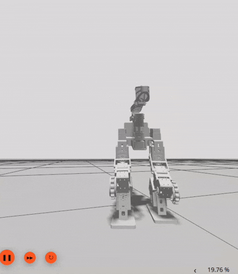
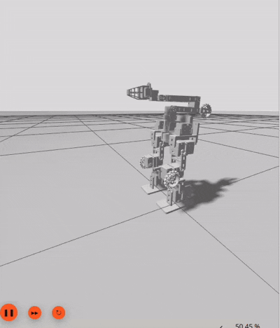
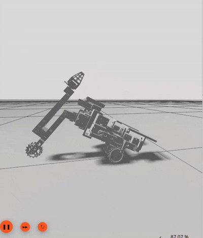
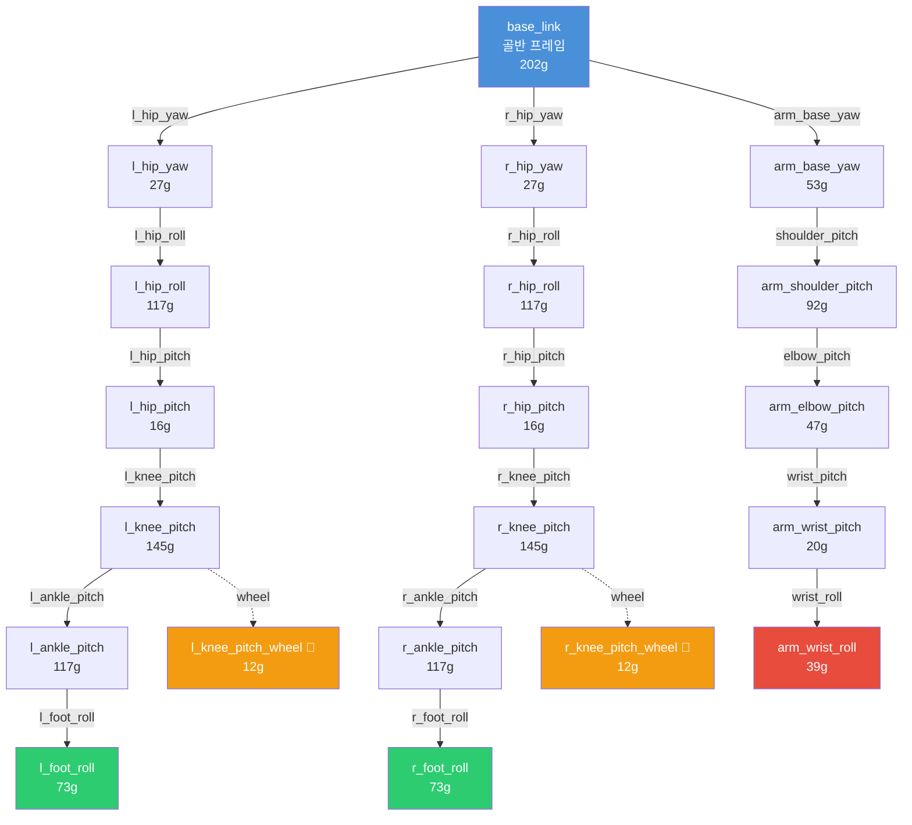

# 🤖 Biped Bike Robot — 로봇 구조 분석 문서

> **biped_bike_robot_ver5** — SolidWorks에서 설계된 **이족보행 ↔ 2구동 휠 + 볼캐스터 로봇 변환 시스템**  
> ROS 2 Jazzy + Gazebo Harmonic 환경

### ✨ Ver.4 업데이트 특징 (Sim-to-Real 최적화)
- **정밀한 무게 반영**: 3D 프린터 슬라이싱 설정값을 기반으로 프레임 파트 하나하나의 실제 무게를 URDF에 정확히 반영했습니다.
- **부품 마운트 추가**: 배터리 및 메인 기판 홀더(Holder) 파트가 추가되었습니다.
- **실제 하드웨어 무게 통합**: 메인 기판과 배터리의 실측 무게가 물리 엔진에 그대로 반영되어, Sim-to-Real(가상-현실)의 괴리를 최소화하고 보행 및 변신 시뮬레이션의 정확도가 극대화되었습니다.

---

## 🎥 주행 및 변신 데모

### 1. 이족 보행 (Bipedal Walking)


### 2. 차륜형 변신 (Transform to Wheeled Mode)


### 3. 이족 보행 모드 복귀 (Reverse Transform)


---

## 📐 관절 트리 다이어그램 (Joint Tree)

```
base_link (골반/허리 프레임)
├── [L] l_hip_yaw ──────── l_hip_yaw (좌측 고관절 요)
│   └── l_hip_roll ─────── l_hip_roll (좌측 고관절 롤)
│       └── l_hip_pitch ── l_hip_pitch (좌측 고관절 피치)
│           └── l_knee_pitch ── l_knee_pitch (좌측 무릎)
│               ├── l_ankle_pitch ── l_ankle_pitch (좌측 발목)
│               │   └── l_foot_roll ── l_foot_roll (좌측 발)
│               └── l_knee_pitch_wheel ── l_knee_pitch_wheel (좌측 무릎 휠) 🔄
│
├── [R] r_hip_yaw ──────── r_hip_yaw (우측 고관절 요)
│   └── r_hip_roll ─────── r_hip_roll (우측 고관절 롤)
│       └── r_hip_pitch ── r_hip_pitch (우측 고관절 피치)
│           └── r_knee_pitch ── r_knee_pitch (우측 무릎)
│               ├── r_ankle_pitch ── r_ankle_pitch (우측 발목)
│               │   └── r_foot_roll ── r_foot_roll (우측 발)
│               └── r_knee_pitch_wheel ── r_knee_pitch_wheel (우측 무릎 휠) 🔄
│
└── [U] arm_base_yaw ──── arm_base_yaw (팔 베이스 요)
    └── arm_shoulder_pitch ── arm_shoulder_pitch (어깨 피치)
        ├── arm_elbow_pitch ── arm_elbow_pitch (팔꿈치 피치)
        │   └── arm_wrist_pitch ── arm_wrist_pitch (손목 피치)
        │       └── arm_wrist_roll ── arm_wrist_roll (손목 롤)
```

> 🔄 = `continuous` 타입 (무한 회전 가능한 패시브 휠 관절)
> ver5에서는 팔 끝 지지를 회전 휠 조인트가 아니라 볼캐스터 구조로 처리합니다.

---

## 📊 링크 목록 (20개)

| # | 링크 이름 | 위치 | 질량 (kg) | 설명 |
|---|-----------|------|-----------|------|
| 1 | `base_link` | 중심 | 0.560 | 골반/메인 프레임 (메인 기판 및 배터리 반영) |
| 2 | `l_hip_yaw` | 좌측 | 0.027 | 좌측 고관절 요 회전부 |
| 3 | `l_hip_roll` | 좌측 | 0.117 | 좌측 고관절 롤 링크 |
| 4 | `l_hip_pitch` | 좌측 | 0.014 | 좌측 고관절 피치 링크 |
| 5 | `l_knee_pitch` | 좌측 | 0.145 | 좌측 허벅지 (상부 다리) |
| 6 | `l_ankle_pitch` | 좌측 | 0.117 | 좌측 정강이 (하부 다리) |
| 7 | `l_foot_roll` | 좌측 | 0.075 | 좌측 발 |
| 8 | `l_knee_pitch_wheel` | 좌측 | 0.012 | 좌측 무릎 보조 휠 |
| 9 | `r_hip_yaw` | 우측 | 0.027 | 우측 고관절 요 회전부 |
| 10 | `r_hip_roll` | 우측 | 0.117 | 우측 고관절 롤 링크 |
| 11 | `r_hip_pitch` | 우측 | 0.014 | 우측 고관절 피치 링크 |
| 12 | `r_knee_pitch` | 우측 | 0.145 | 우측 허벅지 (상부 다리) |
| 13 | `r_ankle_pitch` | 우측 | 0.117 | 우측 정강이 (하부 다리) |
| 14 | `r_foot_roll` | 우측 | 0.075 | 우측 발 |
| 15 | `r_knee_pitch_wheel` | 우측 | 0.012 | 우측 무릎 보조 휠 |
| 16 | `arm_base_yaw` | 상체 | 0.053 | 팔 베이스 요 회전부 |
| 17 | `arm_shoulder_pitch` | 상체 | 0.101 | 상완 (어깨 피치) |
| 18 | `arm_elbow_pitch` | 상체 | 0.047 | 전완 (팔꿈치 피치) |
| 19 | `arm_wrist_pitch` | 상체 | 0.020 | 손목 피치 |
| 20 | `arm_wrist_roll` | 상체 | 0.039 | 손목 롤 / 엔드이펙터 |
> **총 질량**: 약 **1.845 kg** (Sim-to-Real 실측치 일치)

---

## 🔩 관절 목록 (19개)

### 좌측 다리 (Left Leg) — 6 액추에이터 + 1 패시브

| # | 관절 이름 | 타입 | 축 | 부모 → 자식 |
|---|-----------|------|-----|-------------|
| 1 | `l_hip_yaw` | revolute | Z(-) | base_link → l_hip_yaw |
| 2 | `l_hip_roll` | revolute | Z(-) | l_hip_yaw → l_hip_roll |
| 3 | `l_hip_pitch` | revolute | Z(+) | l_hip_roll → l_hip_pitch |
| 4 | `l_knee_pitch` | revolute | Z(-) | l_hip_pitch → l_knee_pitch |
| 5 | `l_ankle_pitch` | revolute | Z(-) | l_knee_pitch → l_ankle_pitch |
| 6 | `l_foot_roll` | revolute | Z(-) | l_ankle_pitch → l_foot_roll |
| 7 | `l_knee_pitch_wheel` | **continuous** | Z(-) | l_knee_pitch → l_knee_pitch_wheel |

### 우측 다리 (Right Leg) — 6 액추에이터 + 1 패시브

| # | 관절 이름 | 타입 | 축 | 부모 → 자식 |
|---|-----------|------|-----|-------------|
| 8 | `r_hip_yaw` | revolute | Z(-) | base_link → r_hip_yaw |
| 9 | `r_hip_roll` | revolute | Z(-) | r_hip_yaw → r_hip_roll |
| 10 | `r_hip_pitch` | revolute | Z(-) | r_hip_roll → r_hip_pitch |
| 11 | `r_knee_pitch` | revolute | Z(-) | r_hip_pitch → r_knee_pitch |
| 12 | `r_ankle_pitch` | revolute | Z(-) | r_knee_pitch → r_ankle_pitch |
| 13 | `r_foot_roll` | revolute | Z(-) | r_ankle_pitch → r_foot_roll |
| 14 | `r_knee_pitch_wheel` | **continuous** | Z(+) | r_knee_pitch → r_knee_pitch_wheel |

### 상체 (Upper Body) — 5 액추에이터

| # | 관절 이름 | 타입 | 축 | 부모 → 자식 |
|---|-----------|------|-----|-------------|
| 15 | `arm_base_yaw` | revolute | Z(-) | base_link → arm_base_yaw |
| 16 | `arm_shoulder_pitch` | revolute | Z(+) | arm_base_yaw → arm_shoulder_pitch |
| 17 | `arm_elbow_pitch` | revolute | Z(+) | arm_shoulder_pitch → arm_elbow_pitch |
| 18 | `arm_wrist_pitch` | revolute | Z(-) | arm_elbow_pitch → arm_wrist_pitch |
| 19 | `arm_wrist_roll` | revolute | Z(-) | arm_wrist_pitch → arm_wrist_roll |

---

## 🦿 설계 특징

### 1. 좌우 대칭 이족 구조 (ver3 업데이트)
- 각 다리: **6 DOF** (Hip Yaw → Hip Roll → Hip Pitch → Knee Pitch → Ankle Pitch → Foot Roll)
- ver2 대비 **Hip Yaw** 관절이 추가되어 다리의 횡방향 회전이 가능
- 좌우 다리는 `base_link`에서 Y축 방향으로 오프셋 (좌: y=-0.01425, 우: y=-0.13925)
- 고관절 롤(Roll)은 `rpy="0 -π/2 0"`로 90° 회전하여 측면 운동축을 구현

### 2. 차륜 모드를 위한 휠과 볼캐스터
- `l_knee_pitch_wheel`, `r_knee_pitch_wheel` — 2개의 **continuous** 구동 휠 관절
- 팔 끝 지지는 `arm_wheel_pitch_` 조인트 없이 볼캐스터 구조로 처리

### 3. 확장된 단일 팔 구조 (ver3 업데이트)
- `arm_base_yaw` → `arm_shoulder_pitch` → `arm_elbow_pitch` → `arm_wrist_pitch` → `arm_wrist_roll`
- ver2 대비 **5 DOF**로 확장 (기존 4 DOF에서 손목 피치/롤 분리)
- `arm_wrist_roll`이 자전거 핸들을 잡는 최종 엔드이펙터

### 4. 서보 모터 기반 소형 로봇
- 총 질량 약 **1.389 kg** (ver2의 0.934kg 대비 증가)
- 모든 메시가 STL 형식 (SolidWorks 직접 내보내기)
- 관절 리밋이 모두 `lower=0, upper=0, effort=0, velocity=0` → **추후 설정 필요**

---

## 📁 패키지 구조

```
biped_bike_robot/
├── CMakeLists.txt
├── package.xml
├── README.md                    ← 이 문서
├── config/
│   └── controllers.yaml         ← ros2_control 컨트롤러 설정
├── launch/
│   └── gazebo.launch.py         ← Gazebo 시뮬레이션 런치
├── meshes/                      ← 메시 파일 (20개 STL)
│   ├── base_link.STL
│   ├── l_hip_yaw.STL
│   ├── l_hip_roll.STL
│   ├── l_hip_pitch.STL
│   ├── l_knee_pitch.STL
│   ├── l_ankle_pitch.STL
│   ├── l_foot_roll.STL
│   ├── l_knee_pitch_wheel.STL
│   ├── r_hip_yaw.STL
│   ├── r_hip_roll.STL
│   ├── r_hip_pitch.STL
│   ├── r_knee_pitch.STL
│   ├── r_ankle_pitch.STL
│   ├── r_foot_roll.STL
│   ├── r_knee_pitch_wheel.STL
│   ├── arm_base_yaw.STL
│   ├── arm_shoulder_pitch.STL
│   ├── arm_elbow_pitch.STL
│   ├── arm_wrist_pitch.STL
│   └── arm_wrist_roll.STL
├── urdf/
│   └── biped_bike_robot_ver.urdf  ← SolidWorks 내보내기 URDF (ver3)
├── scripts/
│   ├── op3_walker.py        ← 메인 보행 엔진 (Walking Engine)
│   ├── transform_bike.py    ← 바이크 모드 변신 시퀀스
│   ├── revert_bike.py       ← 이족보행 모드 복구 시퀀스
│   ├── bike_teleop.py       ← 키보드(WASD) 주행 컨트롤러
│   ├── ready_posture.py      ← 기본 차렷 자세 초기화
│   └── patch_urdf.py        ← SolidWorks→ROS 2 자동 보정 도구
└── solidworks_export/             ← SolidWorks 원본 (수정 금지)
    ├── README.md
    ├── urdf/
    └── meshes/
```

---

## 🔗 관절 연쇄 다이어그램 (Kinematic Chain)


```mermaid
graph TD
    B["base_link<br/>골반 프레임<br/>202g"]

    B -->|l_hip_yaw| LHY["l_hip_yaw<br/>27g"]
    LHY -->|l_hip_roll| LHR["l_hip_roll<br/>117g"]
    LHR -->|l_hip_pitch| LHP["l_hip_pitch<br/>16g"]
    LHP -->|l_knee_pitch| LK["l_knee_pitch<br/>145g"]
    LK -->|l_ankle_pitch| LA["l_ankle_pitch<br/>117g"]
    LA -->|l_foot_roll| LF["l_foot_roll<br/>73g"]
    LK -.->|wheel| LKW["l_knee_pitch_wheel 🔄<br/>12g"]

    B -->|r_hip_yaw| RHY["r_hip_yaw<br/>27g"]
    RHY -->|r_hip_roll| RHR["r_hip_roll<br/>117g"]
    RHR -->|r_hip_pitch| RHP["r_hip_pitch<br/>16g"]
    RHP -->|r_knee_pitch| RK["r_knee_pitch<br/>145g"]
    RK -->|r_ankle_pitch| RA["r_ankle_pitch<br/>117g"]
    RA -->|r_foot_roll| RF["r_foot_roll<br/>73g"]
    RK -.->|wheel| RKW["r_knee_pitch_wheel 🔄<br/>12g"]

    B -->|arm_base_yaw| ABY["arm_base_yaw<br/>53g"]
    ABY -->|shoulder_pitch| ASP["arm_shoulder_pitch<br/>92g"]
    ASP -->|elbow_pitch| AEP["arm_elbow_pitch<br/>47g"]
    AEP -->|wrist_pitch| AWP["arm_wrist_pitch<br/>20g"]
    AWP -->|wrist_roll| AWR["arm_wrist_roll<br/>39g"]

    style B fill:#4a90d9,color:#fff
    style LF fill:#2ecc71,color:#fff
    style RF fill:#2ecc71,color:#fff
    style AWR fill:#e74c3c,color:#fff
    style LKW fill:#f39c12,color:#fff
    style RKW fill:#f39c12,color:#fff
```

---

## ⚠️ ver2 → ver3 주요 변경사항

| 항목 | ver2 | ver3 |
|------|------|------|
| 링크 수 | 18개 | **20개** |
| 관절 수 | 17개 | **19개** |
| 다리 DOF | 5 (Roll→Pitch→Knee→Ankle→Foot) | **6** (Yaw→Roll→Pitch→Knee→Ankle→Foot) |
| 팔 DOF | 4 (Waist→Arm1→Arm2→EndEffector) | **5** (BaseYaw→Shoulder→Elbow→WristPitch→WristRoll) |
| 총 질량 | ~0.934 kg | **~1.389 kg** |
| 관절 이름 규칙 | `_joint` / `_link` 접미사 | **기능 기반** 이름 (e.g. `l_hip_yaw`, `arm_elbow_pitch`) |
| 패키지 참조 | `biped_bike_robot_ver2` | `biped_bike_robot_ver3` |

---

## 📝 참고 사항

- **URDF 생성**: SolidWorks to URDF Exporter v1.6.0-4-g7f85cfe
- **패키지 경로**: URDF 내 `package://biped_bike_robot_ver3/` → 패치 시 `package://biped_bike_robot/`로 변환 필요
- **패치 스크립트**: `scripts/patch_urdf.py` — ver3에 맞게 업데이트 필요
- **관절 리밋 미설정**: 모든 revolute 관절의 `effort`, `velocity`, `lower`, `upper`가 0 → 실제 서보 사양에 맞게 설정 필요
- **좌표계**: SolidWorks 기본 좌표계 사용 (일부 관절에 90° 회전 보정 적용됨)
- **컨트롤러 설정**: `config/controllers.yaml`는 아직 ver2 관절 이름 사용 중 → ver3에 맞게 업데이트 필요
